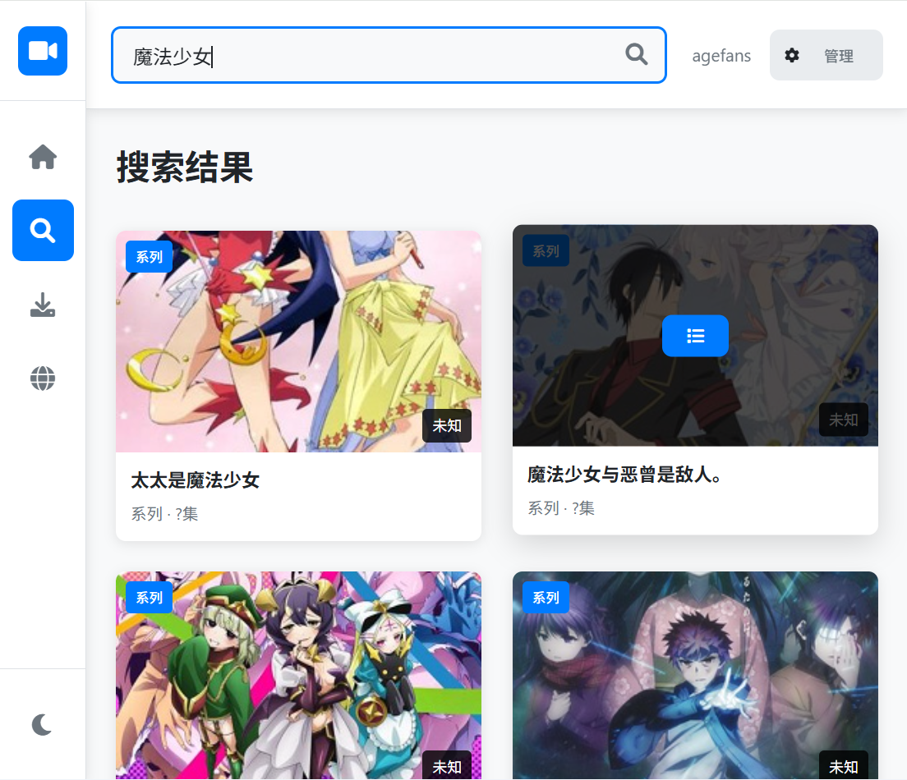
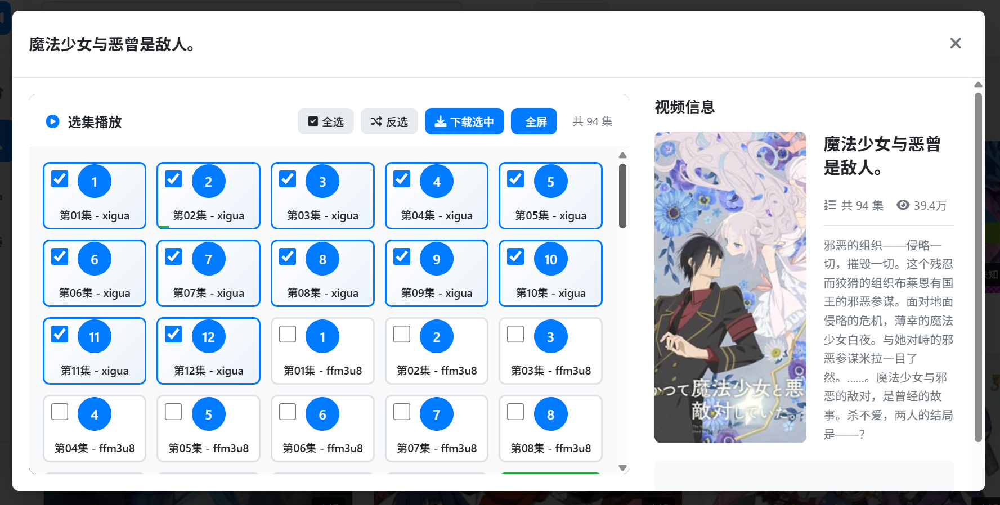

# VDown - 视频下载器

一个基于Deno的视频下载器，支持多源切换、视频搜索、M3U8解析、系列视频、短视频和下载功能。




> [!IMPORTANT]
> 由于这个视频管理器最初是为了R18内容编写的，因此我们不会对项目进行宣传<br>
> 对于agefans动漫的支持只是一时兴起，你完全可以使用，但是不推荐暴露在公网<br>
> 对管理器内任何视频造成的任何问题，你需要自己承担，不只是版权

## 功能特性

- 多视频源支持，可轻松切换不同视频源
- 主页视频浏览、系列浏览、短视频
- 视频搜索（支持多页结果）
- M3U8视频链接解析和代理
- 图片代理（支持需要解码的图片）
- 视频下载（使用FFmpeg）
- 现代化的Web界面
- 在线视频播放（支持多种清晰度切换）

## 支持源
 - agefans动漫（推荐）
 - akianime动漫（还有很多与这个源高度相似的，可以以此扩展）
 - <del>aowu动漫</del> 已经删除，地址改来改去，没价值
 - 1anime动漫（推荐）
 - HAnime1黄漫
 - AVBebe 二次元动画（推荐）
 - SMWeiaona（推荐）
 - 海贼王（推荐）
 - 17c
 - GG51

## 技术栈

- 后端：Deno + Hono + WebSocket
- 前端：原生HTML/CSS/JavaScript + ArtPlayer
- 下载：FFmpeg（需要系统安装）

## 安装和运行

### 前置要求

1. 安装 [Deno](https://deno.land/)
2. 安装 [FFmpeg](https://ffmpeg.org/)（用于视频下载）

### 运行步骤

1. 克隆或下载项目
2. 在项目目录中运行：

```bash
# 开发模式（自动重启）
deno task dev

# 生产模式
deno task start

# 或者直接运行
deno run -A main.ts
```

3. 打开浏览器访问 `http://localhost:9876`

## 项目结构

```
vdown/
├── deno.json              # Deno配置文件
├── main.ts                # 主入口文件
├── src/
│   ├── sources/           # 视频源实现(省略具体源)
│   │   ├── base.ts        # 视频源基类
│   │   └── manager.ts     # 视频源管理器
│   ├── types/             # 类型定义
│   │   └── index.ts
│   ├── utils/             # 工具函数
│   │   ├── m3u8.ts        # M3U8解析工具
│   │   ├── fetch.ts       # 网络请求工具
│   │   ├── download.ts    # 下载管理工具
│   │   ├── logger.ts      # 日志工具
│   │   ├── validation.ts  # 参数验证工具
│   │   └── check.ts       # 检查工具
│   ├── websocket/         # WebSocket RPC
│   │   ├── rpc.ts         # RPC服务器
│   │   └── push.ts        # 推送服务
│   └── server.ts          # 服务器主文件
└── public/                # 前端静态文件
    ├── index.html         # 主页面
    ├── style.css          # 样式文件
    ├── app.js             # 前端JavaScript
    ├── api.js             # API客户端
    ├── player.js          # 播放器组件
    ├── utils.js           # 前端工具函数
    └── websocket.js       # WebSocket RPC客户端
```

## M3U8处理

应用支持M3U8视频流的解析和下载，具有以下特性：

1. **M3U8解析**：解析M3U8文件，提取不同质量的视频流
2. **代理服务**：通过内置代理服务器处理M3U8和TS文件请求
3. **TS流修复**：自动修复损坏的TS流数据，确保下载完整性
4. **FFmpeg集成**：使用FFmpeg下载和转换M3U8视频流

### M3U8处理流程

1. 解析原始M3U8文件，提取视频流信息
2. 创建代理M3U8内容，用于FFmpeg下载
3. 通过代理服务器处理TS文件请求
4. 使用FFmpeg下载完整视频

## 视频播放

应用集成了ArtPlayer播放器，支持：

1. **多种清晰度切换**：自动解析视频的不同清晰度选项
2. **M3U8流播放**：支持HLS协议的视频流播放
3. **画中画模式**：支持浏览器画中画功能
4. **全屏播放**：支持全屏和网页全屏模式
5. **播放速度控制**：支持调整播放速度
6. **快捷键支持**：支持键盘快捷键控制
7. **跳过代理播放**：支持直接播放（使用CORS）

## WebSocket RPC

后端提供 WebSocket RPC 接口，支持实时推送：

- **下载状态推送**：实时获取下载进度更新
- **视频源切换推送**：源切换时主动通知前端
- **RPC 方法**：所有 HTTP API 都有对应的 RPC 版本

### WebSocket 连接

```javascript
// 使用简单的RPC协议。可以参照 public/websocket.js
new WebSocket("ws://localhost:9876/ws");
```

### RPC 方法示例

```javascript
// 调用 RPC 方法
const result = await wsClient.call("videos.search", ["query", 1]);

// 监听推送
wsClient.onPush("downloads.update", (data) => {
    console.log("下载更新:", data);
});
```

## 添加新的视频源

1. 在 `src/sources/` 目录下创建新的视频源类，继承 `BaseVideoSource`
2. 实现必要的方法：
   - `getHomeVideos()`: 获取主页视频列表
   - `searchVideos()`: 搜索视频
   - `parseVideoUrl()`: 解析视频链接获取M3U8
3. 在 `src/sources/manager.ts` 中注册新的视频源

### 示例视频源实现

```typescript
import { BaseVideoSource } from './base.ts';
import { VideoItem, SearchResult, IM3U8Result, ISeriesResult } from '../types/index.ts';

export class MyVideoSource extends BaseVideoSource {
  constructor() {
    // 可选，是否支持系列，对于 短视频/系列视频需要设置为true
    super('my-source', '我的视频源', 'https://my-video-site.com', false);
  }

  async getHomeVideos(page?: number): Promise<ISearchResult> {
    // 实现获取主页视频的逻辑
  }

  async searchVideos(query: string, page?: number): Promise<ISearchResult> {
    // 实现搜索视频的逻辑
  }

  async parseVideoUrl(url: string): Promise<IM3U8Result[]> {
    // 实现解析视频链接的逻辑
    // 返回的 IM3U8Result 支持以下选项：
    // - url: 视频URL
    // - quality: 清晰度
    // - referrer: 用于前端?referer参数
    // - proxy: 是否使用代理
  }

  async getSeries(seriesId: string, url?: string): Promise<ISeriesResult> {
    // 可选，只有当启用时才需要实现
    // 可以同时接收ID和URL，源自行选择合适的方法
  }
}
```

## 配置

新版本的管理器支持了配置文件(config.json)，你可以参照`config.json.example`修改配置

## 注意事项

1. 确保FFmpeg已安装并添加到系统PATH
2. 下载目录需要写权限
3. 临时文件（temp目录）会在下载完成后自动清理
4. 本项目仅用于学习和研究目的，请遵守相关法律法规和网站的使用条款
5. 下载视频时请尊重版权，不要用于商业用途
6. 使用图片代理功能时，请遵守目标网站的robots.txt规则

## 许可证

MIT License